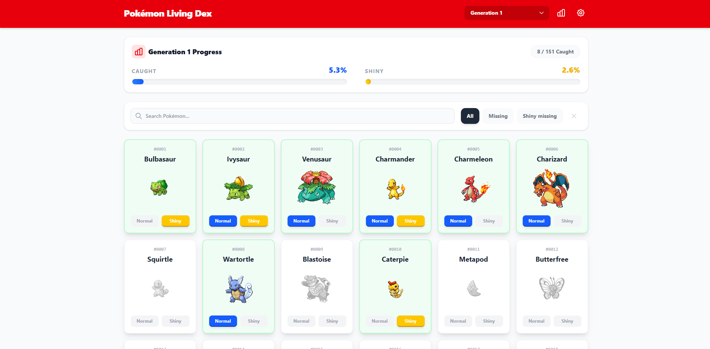
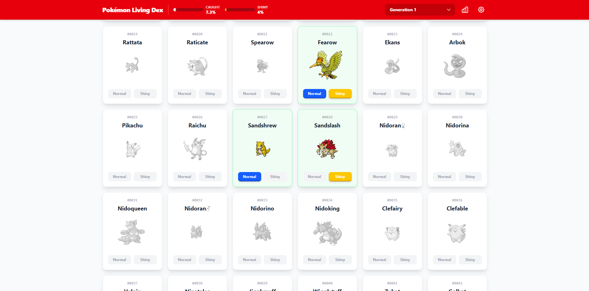
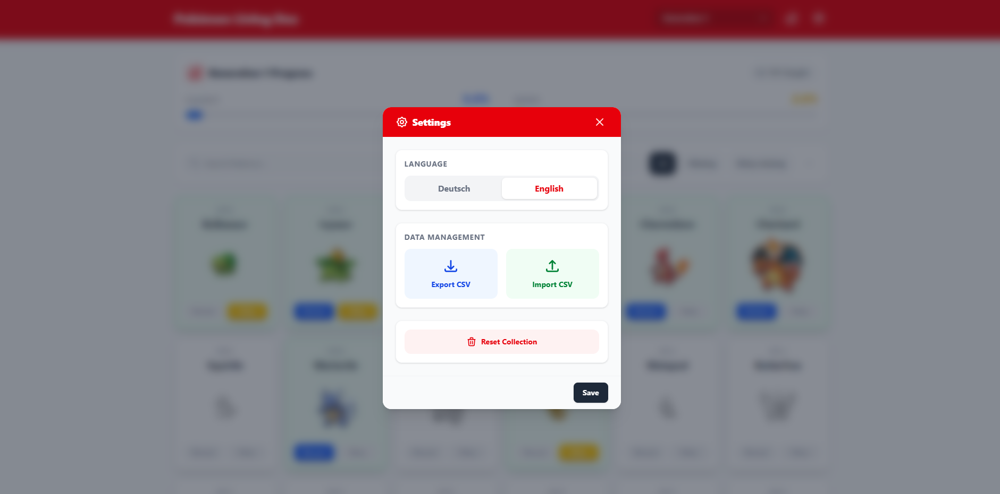
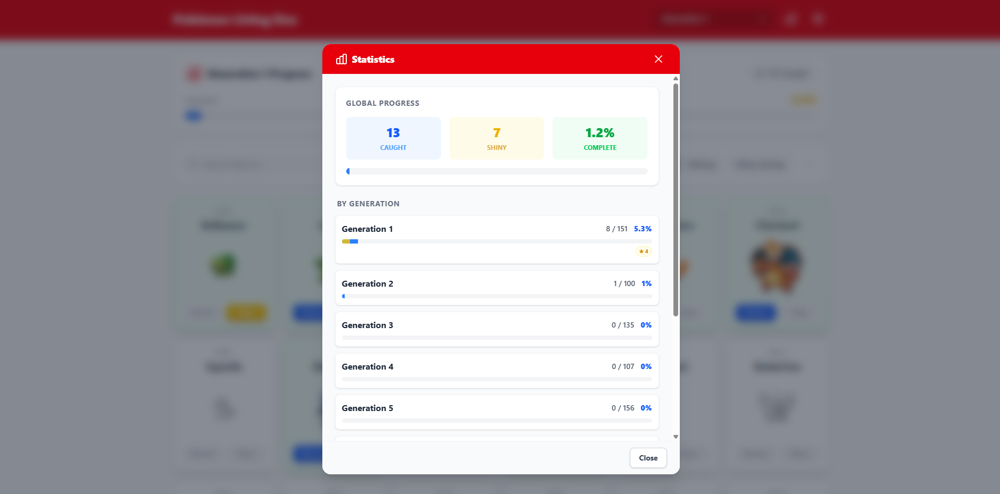
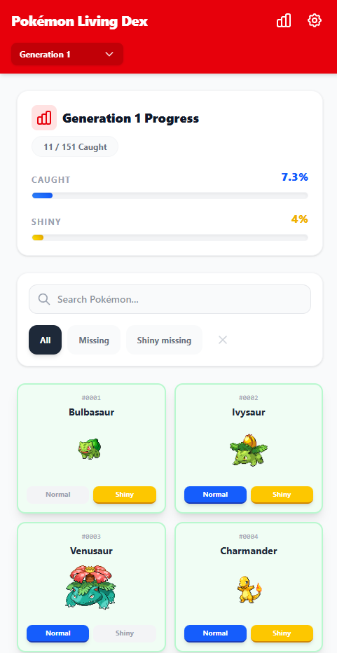
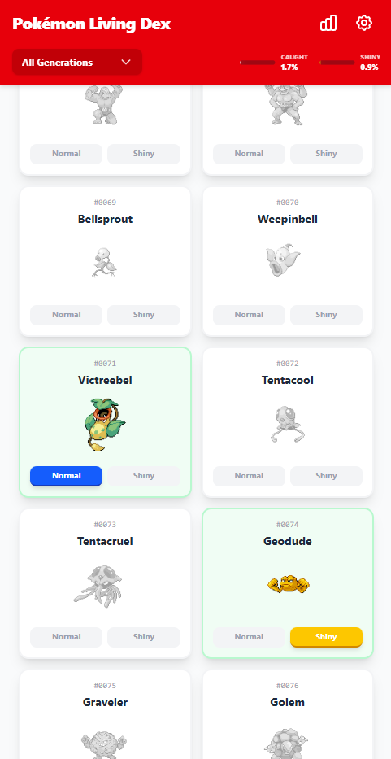

# Pokémon Living Dex Tracker

A modern web application to track your progress in building a "Living Dex" (collecting every Pokémon).

## Features

- **Comprehensive Tracking**: Track both Normal and Shiny variants for all Pokémon generations.
- **Generation Filtering**: View progress for specific generations or all at once.
- **Statistics**: Detailed statistics on capture progress, including shiny collection rates.
- **Import/Export**: Backup and restore your collection data easily via CSV files.
- **Progress Reset**: Reset your entire progress if you want to start fresh.
- **Offline Support**: Caches Pokémon sprites for offline viewing after initial load.
- **Multi-language**: Supports both English and German (switchable in settings).
- **Search & Filter**: Quickly find Pokémon by name or ID, and filter by "Missing" or "Shiny Missing".
- **Responsive Design**: Optimization for both desktop and mobile usage.

## Screenshots

### Desktop View
<p align="center">
  <a href="screenshots/desktop_collection_view_1.png"></a>
  <a href="screenshots/desktop_collection_view_2.png"></a>
</p>

### Management & Statistics
<p align="center">
  <a href="screenshots/desktop_settings_view.png"></a>
  <a href="screenshots/desktop_statistics_view.png"></a>
</p>

### Mobile View
<p align="center">
  <a href="screenshots/mobile_collection_view_1.png"></a>
  <a href="screenshots/mobile_collection_view_2.png"></a>
</p>

## Getting Started

Follow these instructions to start the application locally.

### Prerequisites
- Python 3.8+
- Node.js 16+

### 1. Backend Setup
The backend is built with FastAPI.

```bash
# Navigate to the backend directory
cd backend

# Create and activate a virtual environment (Windows)
python -m venv venv
venv\Scripts\activate

# Install dependencies
pip install -r requirements.txt

# Initialize the database and seed data
python seed.py

# Start the server
python -m uvicorn main:app --reload
```
*The API will be available at http://127.0.0.1:8000*

### 2. Frontend Setup
The frontend is built with React and Vite.

```bash
# Navigate to the frontend directory
cd frontend

# Install dependencies
npm install

# Start the development server
npm run dev

# Or run in production mode
npm run build
npm run preview
```
*The application will optionally run at http://localhost:5173*

### 3. Deployment (Frontend)
To deploy the frontend to a static host (e.g., Vercel, Netlify, GitHub Pages, or a web server like Nginx):

1. **Build the application**:
   ```bash
   npm run build
   ```
   This creates a `dist` folder containing the compiled assets.

2. **Upload/Serve the `dist` folder**:
   - **Static Host**: Point your hosting service to the `dist` directory.
   - **Web Server**: Copy the contents of `dist` to your server's public web folder.

*Note: Ensure your frontend is configured to communicate with the production URL of your backend API.*

## Running Tests

Unit tests are provided for the backend logic.

```bash
# Ensure you are in the backend directory and your venv is activated
cd backend
venv\Scripts\activate

# Run tests using pytest
pytest
```

## Acknowledgements

- **[PokeAPI](https://pokeapi.co/)**: Huge thanks to PokeAPI for providing the extensive Pokémon data, sprites, and information used in this project.

